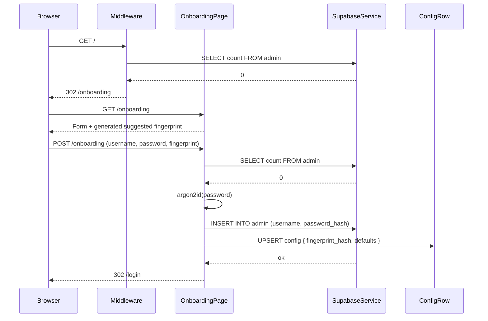
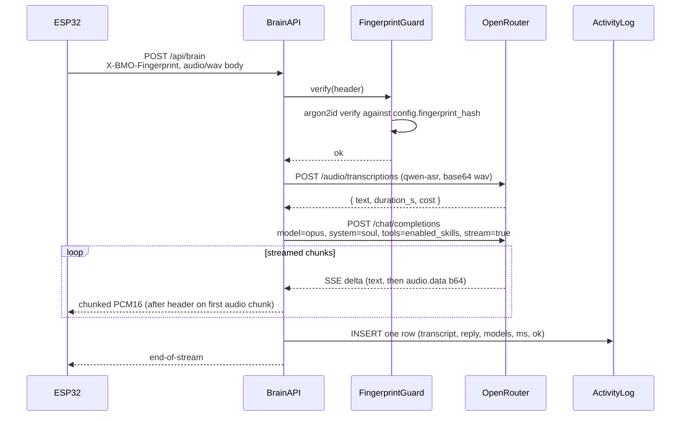

# Design Document

## Overview

The BMO Dashboard is a Next.js 15 application (App Router) deployed on Vercel that serves two audiences from a single codebase:

1. **The human admin**, through a browser UI, configures BMO's persona, skills, providers, and credentials, and watches an activity log.**
2. **The BMO ESP32-C3 firmware**, through a small set of HTTP API routes, uses the dashboard as its cognitive backend (STT → LLM → TTS) for every interaction.**

Supabase is the single persistence layer: it holds the admin record, the soul document, the skill configuration, the ESP32 fingerprint, and the activity log. OpenRouter is the only upstream provider for LLM, STT, and TTS calls; the dashboard never exposes the OpenRouter key to the browser or to the firmware.**

The design is aggressively minimal. Every page is a Server Component except the few that genuinely need client state (the soul editor, the activity log auto-refresher, the credits poller). Every API route is a thin orchestrator that validates the ESP32 fingerprint, calls a provider client, and writes one log row. There is no in-memory state on the dashboard server beyond per-request execution; restarting a Vercel function loses nothing.**

## Architecture

### Component Overview

```
┌──────────────────────────────────────────────────────────────────────┐
│                         BMO Dashboard (Next.js)                      │
│                                                                      │
│  ┌─────────────────────────┐    ┌──────────────────────────────┐    │
│  │   Admin UI (App Router) │    │   API Routes (App Router)    │    │
│  │  - /onboarding          │    │  - /api/voice/stt            │    │
│  │  - /login               │    │  - /api/voice/tts            │    │
│  │  - / (home + credits)   │    │  - /api/brain                │    │
│  │  - /soul                │    │  - /api/openrouter/credits   │    │
│  │  - /skills              │    │  - /api/openrouter/usage     │    │
│  │  - /providers           │    │                              │    │
│  │  - /fingerprint         │    │  Each route:                 │    │
│  │  - /activity            │    │  1. Verify X-BMO-Fingerprint │    │
│  │                         │    │  2. Call OpenRouter via SDK  │    │
│  │  Auth via session cookie│    │  3. Write Activity_Log       │    │
│  └────────────┬────────────┘    └────────────────┬─────────────┘    │
│               │                                  │                   │
│               └──────────────┬───────────────────┘                   │
│                              ▼                                        │
│                  ┌──────────────────────┐                            │
│                  │  /lib (server-only)  │                            │
│                  │  - supabase clients  │                            │
│                  │  - auth helpers      │                            │
│                  │  - openrouter client │                            │
│                  │  - log writer        │                            │
│                  └──────────────────────┘                            │
└──────────────────────────────────────────────────────────────────────┘
                              │                ▲
                              ▼                │
┌──────────────────────────────────────────────────────────────────────┐
│                              Supabase                                │
│  Tables:                                                             │
│   - admin (singleton row, RLS service-role only)                     │
│   - config (singleton key-value: soul, skills, fingerprint, models)  │
│   - activity_log (append-only)                                       │
└──────────────────────────────────────────────────────────────────────┘
                              ▲
                              │ HTTPS over WiFi
                              │ X-BMO-Fingerprint: <secret>
┌──────────────────────────────────────────────────────────────────────┐
│                       BMO Firmware (ESP32-C3)                        │
│  - Captures audio via INMP441 mic                                    │
│  - POST /api/brain  (multipart audio)                                │
│  - Streams response audio to MAX98357A                               │
│  - Animates face based on phase (listening / thinking / talking)     │
│  - Reads BMO_DASHBOARD_URL and BMO_FINGERPRINT from secrets.h        │
│    (gitignored, generated from Local_Env_File at build time)         │
└──────────────────────────────────────────────────────────────────────┘
```

### Key Architectural Choices

**Server Components by default.** The admin UI is server-rendered. Only forms (onboarding, login, soul editor) and live elements (credits poller, activity log) are client components. This keeps the bundle small and lets Supabase queries run server-side without exposing the service-role key.**

**Two Supabase clients.** A `service-role` client for server-only operations (writing the admin row, reading any table, writing logs) and an `anon` client for client-side read-only queries. The service-role client lives in `/lib/supabase-admin.ts` and is the only file that imports `SUPABASE_SERVICE_ROLE_KEY`. Lints/CI guard against importing that file from `app/**` client components.**

**Single config row.** Configuration (soul, skills, fingerprint, model selections) lives in one `config` row keyed by id=1. This keeps the schema trivial and onboarding atomic. Activity log is the only multi-row table.**

**Streaming TTS through the dashboard.** The ESP32 expects raw PCM16 mono @ 24 kHz (no on-device decoder). The dashboard's `/api/brain` and `/api/voice/tts` open a streaming OpenRouter chat-completion call (`openai/gpt-audio-mini`, `modalities: ['text','audio']`, `audio.format: 'pcm16'`, `stream: true`), unwraps the SSE chunks, prepends a 44-byte WAV/RIFF header, and streams the rest as `Transfer-Encoding: chunked` to the firmware. First audio byte target: under 1500 ms.**

**Single onboarding gate.** A request-time middleware checks for an admin row. If zero, redirects to `/onboarding`; if one, blocks `/onboarding`. The check is cached for 30 seconds per Vercel function instance to avoid hammering Supabase.**

**Stateless rate limit.** Login attempts use a Supabase row in `auth_attempts(username, attempted_at)` with a 15-minute lookback window. Five recent failures → 429. Cleared on successful login.**

## System Diagrams

### Sequence: First-Run Onboarding



### Sequence: ESP32 → Brain → Audio



### Module Layout

```
bmo-dashboard/
├── app/
│   ├── (admin)/                       # Protected by session-cookie middleware
│   │   ├── layout.tsx                 # Sidebar + auth gate
│   │   ├── page.tsx                   # Home: credits + recent activity (server)
│   │   ├── soul/page.tsx              # Soul markdown editor (client)
│   │   ├── skills/page.tsx            # Skill toggles (server form actions)
│   │   ├── providers/page.tsx         # Model & voice selectors
│   │   ├── fingerprint/page.tsx       # Fingerprint rotate + masked view
│   │   └── activity/page.tsx          # Activity log table (server)
│   ├── onboarding/
│   │   ├── page.tsx                   # Wizard (server form action)
│   │   └── actions.ts                 # createAdmin server action
│   ├── login/
│   │   ├── page.tsx                   # Form
│   │   └── actions.ts                 # login server action
│   ├── api/
│   │   ├── voice/
│   │   │   ├── stt/route.ts
│   │   │   └── tts/route.ts
│   │   ├── brain/route.ts
│   │   ├── openrouter/
│   │   │   ├── credits/route.ts
│   │   │   └── usage/route.ts
│   │   └── _lib/
│   │       ├── fingerprint-guard.ts   # X-BMO-Fingerprint verifier
│   │       └── log.ts                 # Activity log writer
│   ├── middleware.ts                  # Onboarding redirect + admin auth
│   ├── layout.tsx
│   └── globals.css
├── lib/
│   ├── supabase-admin.ts              # service-role client (server-only)
│   ├── supabase-anon.ts               # anon client
│   ├── auth.ts                        # session cookie helpers, argon2 wrapper
│   ├── openrouter.ts                  # provider client (chat, audio.transcribe, audio.speech)
│   ├── config.ts                      # typed config row reader/writer
│   ├── env.ts                         # zod-validated env loader
│   └── log.ts                         # log-write helpers
├── supabase/
│   ├── schema.sql                     # tables + RLS policies
│   └── seed.sql                       # default soul / skill rows for fresh boot
├── components/                        # shared UI
├── public/
├── .env.example
├── .gitignore                         # excludes .env, .env.local, .env.*.local
├── next.config.ts
├── tsconfig.json
└── package.json
```

## Components and Interfaces

### Component: AuthService

Owns admin authentication, session cookies, fingerprint validation, and login lockout. Pure server-side.**

```ts
// lib/auth.ts
export interface AdminRow {
  id: number;
  username: string;
  password_hash: string;       // argon2id
  created_at: string;
}

export interface SessionPayload {
  username: string;
  iat: number;                  // issued-at unix seconds
}

/** Hashes plaintext with argon2id memory-hard params. */
export async function hashPassword(plain: string): Promise<string>;

/** Constant-time compare of plaintext against argon2 hash. */
export async function verifyPassword(plain: string, hash: string): Promise<boolean>;

/** Issues HTTP-only Secure SameSite=Lax cookie, JWT-signed (HS256, secret = AUTH_SESSION_SECRET). */
export function issueSessionCookie(username: string): string;

/** Reads + verifies session cookie from a Next.js Request. Returns null if invalid/expired. */
export function readSession(req: Request): SessionPayload | null;

/** Returns true if the username has 5+ failed attempts in last 15 min. */
export async function isLockedOut(username: string): Promise<boolean>;

/** Atomically inserts a failed attempt row in auth_attempts. */
export async function recordFailedAttempt(username: string): Promise<void>;

/** Clears all auth_attempts rows for the user. Called on success. */
export async function clearAttempts(username: string): Promise<void>;
```

```ts
// app/api/_lib/fingerprint-guard.ts
export interface FingerprintGuardResult {
  ok: boolean;
  reason?: 'missing' | 'mismatch';
}

/** Verifies X-BMO-Fingerprint against config.fingerprint_hash via argon2. */
export async function verifyFingerprint(req: Request): Promise<FingerprintGuardResult>;
```

### Component: ConfigService

Single source of truth for the configuration row. Caches the row for 5 seconds per function instance to avoid Supabase round-trips on hot paths (every brain call reads this).**

```ts
// lib/config.ts
export interface BmoConfig {
  soul_md: string;
  skills: Record<SkillName, SkillConfig>;
  fingerprint_hash: string;
  llm_model: string;            // e.g. "openai/gpt-4.1-mini" or "anthropic/claude-opus-4-6"
  stt_model: string;            // e.g. "qwen/qwen3-asr-flash-2026-02-10"
  tts_model: string;            // e.g. "openai/gpt-audio-mini"
  tts_voice: string;            // e.g. "nova"
  updated_at: string;
}

export type SkillName =
  | 'web_search' | 'sing' | 'play_music' | 'story' | 'comfort' | 'play_pretend';

export interface SkillConfig {
  enabled: boolean;
  params?: Record<string, unknown>;
}

export async function getConfig(): Promise<BmoConfig>;
export async function updateConfig(patch: Partial<BmoConfig>): Promise<BmoConfig>;
export function clearConfigCache(): void;
```

### Component: OpenRouterService

The only place that knows OpenRouter exists. Reads `OPENROUTER_API_KEY` server-side. All other components call this.**

```ts
// lib/openrouter.ts
export interface ChatRequest {
  model: string;
  systemPrompt: string;
  messages: Array<{ role: 'user' | 'assistant'; content: string }>;
  tools?: Array<OpenRouterTool>;
  signal?: AbortSignal;
}

export interface ChatResponse {
  text: string;
  inputTokens?: number;
  outputTokens?: number;
  costUsd?: number;
}

export async function chat(req: ChatRequest): Promise<ChatResponse>;

export interface TranscribeRequest {
  audio: Buffer;
  format: 'wav' | 'mp3' | 'flac';
  model: string;
  language?: string;
  signal?: AbortSignal;
}

export interface TranscribeResponse {
  text: string;
  durationSeconds?: number;
  costUsd?: number;
}

export async function transcribe(req: TranscribeRequest): Promise<TranscribeResponse>;

export interface SynthesizeStreamRequest {
  model: string;
  voice: string;
  text: string;
  systemPrompt?: string;
  signal?: AbortSignal;
}

/** Yields raw PCM16 mono @ 24kHz chunks as they arrive from OpenRouter. */
export async function* synthesizeStream(req: SynthesizeStreamRequest): AsyncIterable<Buffer>;

export interface CreditsResponse {
  total: number;
  used: number;
  remaining: number;
  currency: 'USD';
  fetchedAt: number;
}

export async function fetchCredits(): Promise<CreditsResponse>;
```

### Component: BrainOrchestrator

Glues STT → LLM → TTS for the `/api/brain` route. The only stateful thing it does is write one Activity_Log row per request. Pipeline error returns HTTP 502 with `{ stage }`.**

```ts
// app/api/brain/route.ts (handler outline)
export async function POST(req: Request): Promise<Response> {
  const guard = await verifyFingerprint(req);
  if (!guard.ok) return new Response('unauthorized', { status: 401 });

  const ac = new AbortController();
  req.signal.addEventListener('abort', () => ac.abort());

  const cfg = await getConfig();
  const startedAt = Date.now();

  // 1. Resolve transcript (text bypass or STT)
  const { text, sttMs } = await resolveTranscript(req, cfg, ac.signal);

  // 2. LLM (always Opus via Kiro gateway OR an OpenRouter model — config.llm_model)
  const llmStart = Date.now();
  const reply = await chat({
    model: cfg.llm_model,
    systemPrompt: cfg.soul_md,
    messages: [{ role: 'user', content: text }],
    tools: enabledTools(cfg.skills),
    signal: ac.signal,
  });
  const llmMs = Date.now() - llmStart;

  // 3. Streaming TTS → ESP32
  const stream = new ReadableStream<Uint8Array>({
    async start(controller) {
      controller.enqueue(buildWavHeader(/* unknown length, marker */));
      let bytes = 0;
      try {
        for await (const chunk of synthesizeStream({
          model: cfg.tts_model,
          voice: cfg.tts_voice,
          text: reply.text,
          signal: ac.signal,
        })) {
          controller.enqueue(chunk);
          bytes += chunk.byteLength;
        }
        controller.close();
      } catch (err) {
        controller.error(err);
      } finally {
        await writeActivityLog({
          type: 'brain',
          input: text,
          reply: reply.text,
          ttsBytes: bytes,
          sttMs,
          llmMs,
          totalMs: Date.now() - startedAt,
          ok: true,
          model_llm: cfg.llm_model,
          model_stt: cfg.stt_model,
          model_tts: cfg.tts_model,
        });
      }
    },
  });

  return new Response(stream, {
    headers: {
      'Content-Type': 'audio/L16;rate=24000;channels=1',
      'X-BMO-Reply-Text': encodeURIComponent(reply.text.slice(0, 1024)),
      'X-Accel-Buffering': 'no',
      'Transfer-Encoding': 'chunked',
    },
  });
}
```

### Component: ActivityLogWriter

Writes append-only rows to `activity_log`. Sanitizes inputs (no audio bytes, no fingerprint, no API keys, no password). Truncates `input_text` and `reply_text` to 8 KB each.**

```ts
// app/api/_lib/log.ts
export interface ActivityLogRow {
  type: 'stt' | 'tts' | 'brain';
  input_text?: string;            // transcribed text or input prompt
  reply_text?: string;
  model_stt?: string;
  model_llm?: string;
  model_tts?: string;
  total_ms: number;
  status: 'ok' | 'error';
  error_stage?: 'stt' | 'llm' | 'tts';
  error_message?: string;
}

export async function writeActivityLog(row: ActivityLogRow): Promise<void>;
```

### Component: Onboarding Page

Server component renders the form. A server action verifies zero admin rows, hashes the password, generates a fingerprint if the user requested it, computes its argon2 hash, writes the admin row + config row in a single Supabase transaction, redirects to `/login`.**

```ts
// app/onboarding/actions.ts
'use server';
export interface OnboardingInput {
  username: string;
  password: string;            // ≥12 chars
  fingerprint: string;         // ≥32 bytes hex/base64; or empty to auto-generate
}
export interface OnboardingResult {
  ok: true;
  fingerprint: string;          // returned once for the user to copy
} | {
  ok: false;
  error: 'already_onboarded' | 'weak_password' | 'invalid_fingerprint';
};
export async function createAdmin(input: OnboardingInput): Promise<OnboardingResult>;
```

### Component: Middleware

Single Next.js middleware that:
1. If the request path is an API route under `/api/voice/*`, `/api/brain`, or `/api/openrouter/*`, skip middleware (those routes handle their own auth via fingerprint).**
2. If `/_next/*` or static, skip.**
3. Read admin row count (cached 30s per instance). If zero AND path !== `/onboarding`, redirect to `/onboarding`.**
4. Read admin row count. If ≥1 AND path === `/onboarding`, return 404.**
5. Read session cookie. If missing/invalid AND path !== `/login` AND path !== `/onboarding`, redirect to `/login`.**
6. If session valid, set `x-bmo-username` request header for downstream pages (informational only).**

## Data Models

### Supabase Schema

```sql
-- supabase/schema.sql

-- Single admin row. Created at onboarding, edited only by direct SQL.**
create table public.admin (
  id integer primary key default 1 check (id = 1),
  username text not null unique,
  password_hash text not null,           -- argon2id encoded
  created_at timestamptz not null default now()
);
alter table public.admin enable row level security;
create policy admin_no_anon on public.admin for all to anon using (false);

-- Singleton config row.**
create table public.config (
  id integer primary key default 1 check (id = 1),
  soul_md text not null default '',
  skills jsonb not null default '{}'::jsonb,
  fingerprint_hash text not null,        -- argon2id of the actual fingerprint
  llm_model text not null default 'openai/gpt-4.1-mini',
  stt_model text not null default 'qwen/qwen3-asr-flash-2026-02-10',
  tts_model text not null default 'openai/gpt-audio-mini',
  tts_voice text not null default 'nova',
  updated_at timestamptz not null default now()
);
alter table public.config enable row level security;
create policy config_no_anon on public.config for all to anon using (false);

-- Append-only activity log.**
create table public.activity_log (
  id bigserial primary key,
  created_at timestamptz not null default now(),
  type text not null check (type in ('stt','tts','brain')),
  input_text text,
  reply_text text,
  model_stt text,
  model_llm text,
  model_tts text,
  total_ms integer not null,
  status text not null check (status in ('ok','error')),
  error_stage text check (error_stage in ('stt','llm','tts')),
  error_message text
);
create index activity_log_created_at_desc on public.activity_log (created_at desc);
alter table public.activity_log enable row level security;
create policy activity_log_no_anon on public.activity_log for all to anon using (false);

-- Login attempt rate-limit (rolling 15-minute window).**
create table public.auth_attempts (
  id bigserial primary key,
  username text not null,
  attempted_at timestamptz not null default now()
);
create index auth_attempts_username_time on public.auth_attempts (username, attempted_at desc);
alter table public.auth_attempts enable row level security;
create policy auth_attempts_no_anon on public.auth_attempts for all to anon using (false);
```

All four tables block anon access via RLS. The dashboard server-side code uses the service-role key, which bypasses RLS, so it can read/write freely. The browser-side anon client never reads these tables directly.**

### TypeScript Domain Types

```ts
// lib/types.ts
export type SkillName =
  | 'web_search' | 'sing' | 'play_music' | 'story' | 'comfort' | 'play_pretend';

export interface SkillState {
  enabled: boolean;
  params?: Record<string, unknown>;
}

export interface BmoConfig {
  soul_md: string;
  skills: Record<SkillName, SkillState>;
  fingerprint_hash: string;
  llm_model: string;
  stt_model: string;
  tts_model: string;
  tts_voice: string;
  updated_at: string;
}

export interface BrainTextRequest { text: string; }
// audio is multipart/form-data with field name "audio"
export interface ActivityLogEntry { /* mirrors DB row */ }
```

### Wire Protocol

| Endpoint | Method | Auth | Request | Response |
|---|---|---|---|---|
| `/api/brain` (text) | POST | `X-BMO-Fingerprint` | JSON `{ text }` | `audio/L16;rate=24000;channels=1` chunked |
| `/api/brain` (audio) | POST | `X-BMO-Fingerprint` | multipart `audio=<wav\|mp3\|webm>` | `audio/L16;rate=24000;channels=1` chunked |
| `/api/voice/stt` | POST | `X-BMO-Fingerprint` | `audio/wav` body | JSON `{ text, duration_ms, model }` |
| `/api/voice/tts` | POST | `X-BMO-Fingerprint` | JSON `{ text, voice?, format? }` | streamed audio (PCM16 default) |
| `/api/openrouter/credits` | GET | `X-BMO-Fingerprint` OR session | (none) | JSON `{ total, used, remaining, currency }` |

Reply text reaches the firmware via the `X-BMO-Reply-Text` response header on `/api/brain` (URL-encoded, capped at 1 KB) so the firmware can show captions if it ever wants to. The audio body is the canonical payload.**

## Error Handling

### Failure Modes and Responses

| Failure | HTTP | Body | Logged? |
|---|---|---|---|
| Missing `X-BMO-Fingerprint` header | 401 | `{ error: 'unauthorized' }` | yes (no fingerprint value) |
| Wrong fingerprint | 401 | `{ error: 'unauthorized' }` | yes |
| STT upstream timeout (30s) | 502 | `{ stage: 'stt', error: 'timeout' }` | yes |
| STT upstream HTTP error | 502 | `{ stage: 'stt', error: '<msg>' }` | yes |
| LLM upstream timeout (60s) | 502 | `{ stage: 'llm', error: 'timeout' }` | yes |
| LLM upstream non-2xx | 502 | `{ stage: 'llm', error: '<msg>' }` | yes |
| TTS upstream timeout (30s) | 502 | `{ stage: 'tts', error: 'timeout' }` | yes |
| TTS upstream non-2xx | 502 | `{ stage: 'tts', error: '<msg>' }` | yes |
| Audio body > 25 MB | 413 | `{ error: 'payload_too_large' }` | no |
| TTS text > 4000 chars | 413 | `{ error: 'payload_too_large' }` | no |
| OpenRouter credits call fails | 502 | last successful body + `stale: true` | yes |
| Onboarding submitted post-onboarding | 409 | `{ error: 'already_onboarded' }` | no |
| Login: 5+ failures in 15 min | 429 | `{ error: 'too_many_attempts' }` | yes |
| Soul exceeds 64 KiB | 413 | `{ error: 'too_large' }` | no |

### Stream Failure Handling

Streamed audio responses can fail mid-stream (LLM produces text but TTS dies during audio synthesis). The dashboard:

1. Begins the response with a 200 status and a real WAV header.**
2. If the stream errors before any bytes flow, switches to 502 + JSON instead.**
3. If the stream errors mid-flight, calls `controller.error(err)` which closes the connection abruptly. The ESP32 sees a truncated stream and shows the `error` mood for 1 second, then `idle`.**
4. Always writes one Activity_Log row in the `finally` block recording the partial success / failure.**

### Abort Handling

The ESP32 may close its connection (user released the touch button mid-reply). The dashboard listens to `req.signal` and propagates the abort to the OpenRouter `AbortController`, which closes the upstream stream. Cost gets charged for tokens already produced; that's acceptable.**

## Testing Strategy

### Unit Tests

- `lib/auth.ts` — `hashPassword` / `verifyPassword` round-trip; constant-time check; lockout window logic.**
- `lib/openrouter.ts` — request body shaping for chat, transcribe, synthesizeStream; SSE parser correctness; abort behavior.**
- `app/api/_lib/fingerprint-guard.ts` — accept on match, reject on missing/mismatched.**
- `app/onboarding/actions.ts` — fresh state writes admin + config; second call returns 409.**
- WAV header builder — bytes match canonical RIFF spec.**

### Integration Tests (Vitest + msw)

- `/api/voice/stt` happy path with a small fixture WAV.**
- `/api/voice/tts` happy path; verify Content-Type, header, first chunk arrives within 1500 ms.**
- `/api/brain` text-input path; mock OpenRouter chat + audio.**
- `/api/brain` audio-input path; mock STT + chat + audio.**
- Onboarding gate: middleware redirects when zero admins; 404s `/onboarding` when one admin exists.**
- Login lockout: simulate 5 fails in 14 min, sixth attempt returns 429.**

### End-to-End (Playwright, optional)

- Onboarding wizard creates admin + redirects to login.**
- Login + soul edit + reload retains content.**
- Activity log shows new rows after a brain call.**

### Manual / Hardware Test

- ESP32 firmware flashed with a working fingerprint hits `/api/brain` against staging dashboard, plays back an audible reply through the speaker.**
- Verify rotating the fingerprint in the dashboard breaks the firmware until re-flashed.**

## Security Considerations

- **Service-role key isolation.** Only `lib/supabase-admin.ts` imports `SUPABASE_SERVICE_ROLE_KEY`. ESLint rule `no-restricted-imports` blocks every other path from importing it. The file's first line is `import 'server-only'` so it cannot be bundled into the client.**
- **Argon2id everywhere.** Both admin password and ESP32 fingerprint are stored as argon2id hashes (memory cost 64 MiB, time 3, parallelism 4). The fingerprint is high-entropy so a fast hash would also be safe, but using argon2id consistently means one path, one library.**
- **Constant-time compares.** All fingerprint and password comparisons go through argon2's verify (already constant-time). Session cookie HMAC verifies with `node:crypto.timingSafeEqual`.**
- **Cookie hardening.** `HttpOnly`, `Secure`, `SameSite=Lax`, `Path=/`, signed JWT (HS256, secret in `AUTH_SESSION_SECRET`), 24h TTL.**
- **No secret echoing.** Logs sanitize: never include `X-BMO-Fingerprint`, `Authorization`, `OPENROUTER_API_KEY`, `SUPABASE_SERVICE_ROLE_KEY`, `password`, or `password_hash`.**
- **CORS.** API routes are bound to the firmware only. `/api/voice/*` and `/api/brain` set `Access-Control-Allow-Origin` to `null` (no browser CORS allowed); the firmware doesn't need CORS.**
- **No reset path.** No UI control or API endpoint exposes admin password reset or fingerprint reveal beyond the masked configuration page. Recovery is documented in `docs/RECOVERY.md` (delete + re-insert via Supabase SQL editor).**
- **Onboarding race.** The `INSERT INTO admin` uses `ON CONFLICT (id) DO NOTHING` and re-checks affected row count; concurrent submissions cannot both succeed.**
- **Rate limit on login.** Per-username, sliding 15-minute window, enforced server-side via `auth_attempts` table.**

## Correctness Properties

These are the invariants the system MUST hold at all times. They map directly to the requirements and must be either provably maintained by the design or covered by a test.**

### Property 1: Single admin row

At any moment, the `admin` table contains zero or one row. Enforced by the `check (id = 1)` primary key constraint plus `INSERT ... ON CONFLICT (id) DO NOTHING`. **Validates: Requirements 1, 13**

### Property 2: Onboarding is irreversible

Once an admin row exists, no code path can create or replace it. The dashboard exposes no UI/API to do so. Recovery is via direct Supabase SQL only. **Validates: Requirements 2.5, 13.3**

### Property 3: Onboarding gate

A request to `/onboarding` returns 404 iff `admin` count ≥ 1. A non-API non-static request to any other path redirects to `/onboarding` iff `admin` count = 0. Verified by middleware tests. **Validates: Requirements 1.1, 13.1**

### Property 4: Admin auth required

Every request to `/(admin)/**` either carries a valid session cookie or is redirected to `/login`. No exception. **Validates: Requirements 2.1**

### Property 5: Fingerprint required for firmware API

Every request to `/api/voice/*`, `/api/brain`, and (for non-session callers) `/api/openrouter/*` is rejected with 401 unless a valid `X-BMO-Fingerprint` header verifies against the stored hash. No exception. **Validates: Requirements 3.1, 3.3**

### Property 6: Constant-time auth

Password and fingerprint verification take time independent of the input value, delegated to argon2 verify and `timingSafeEqual`. **Validates: Requirements 2.2, 3.2**

### Property 7: No early exit on auth

The fingerprint guard runs to completion before any handler reads the request body or makes upstream calls. **Validates: Requirements 3.3**

### Property 8: Service-role isolation

`SUPABASE_SERVICE_ROLE_KEY` is read only by `lib/supabase-admin.ts`, which begins with `import 'server-only'`. ESLint enforces `no-restricted-imports` from any other path. **Validates: Requirements 12.2**

### Property 9: No secret echo

Activity log rows, error responses, and console output never include the fingerprint, the OpenRouter key, the service-role key, or the admin password (plaintext or hashed). **Validates: Requirements 3.5, 11.4**

### Property 10: Env-only secrets

No secret value appears in the source tree. `.env`, `.env.local`, and `.env.*.local` are gitignored. CI fails on any commit containing strings matching the secret-shape regexes. **Validates: Requirements 12.3, 12.4,** R12.5

### Property 11: No client bundle leaks

The Next.js production build emits zero references to `SUPABASE_SERVICE_ROLE_KEY`, `OPENROUTER_API_KEY`, or `AUTH_SESSION_SECRET` in any chunk under `.next/static/`. Verified by a post-build grep step. **Validates: Requirements 12.2, 12.7**

### Property 12: Single config row

The `config` table contains zero or one row. Enforced by `check (id = 1)`. **Validates: Requirements 5, 6**

### Property 13: Append-only log

Activity log writes are inserts only. Updates are forbidden by row-level policies; deletions are limited to a single-row delete invoked by the admin from the activity page. **Validates: Requirements 11.2, 11.5**

### Property 14: Log sanitization

Activity log row writes pass through a sanitizer that strips known secret-shaped fields before insert. Test: feed a row containing each banned field, assert it's absent post-write. **Validates: Requirements 11.4**

### Property 15: Soul size cap

A soul update larger than 64 KiB is rejected before any Supabase write. **Validates: Requirements 5.4**

### Property 16: Stage attribution on errors

Every `/api/brain`, `/api/voice/stt`, and `/api/voice/tts` failure response includes the failing stage (`stt | llm | tts`). The corresponding activity log row records the same stage. **Validates: Requirements 7.5, 8.5,** R9.5

### Property 17: Streaming first byte SLO

Under nominal conditions, `/api/brain` and `/api/voice/tts` emit the first audio byte within 2 seconds of receiving a complete request. Tracked as a soft SLO; alerted via log inspection if exceeded. **Validates: Requirements 9.4**

### Property 18: Bounded request size

Audio bodies > 25 MB and TTS text > 4000 chars are rejected with 413 before any upstream call is made. **Validates: Requirements 7.4, 8.4**

### Property 19: Bounded upstream time

STT calls abort at 30s, LLM at 60s, TTS at 30s. AbortController is wired to both `req.signal` and per-stage timers. **Validates: Requirements 7.5, 8.5,** R9.4

### Property 20: Single log row per request

Every API request that passes the fingerprint guard produces exactly one activity log row, regardless of success or stage of failure. Written in a `finally` block. **Validates: Requirements 7.6, 8.6,** R9.6

### Property 21: Disabled skills are unreachable

A request that would invoke a disabled skill receives a refusal in BMO voice and produces zero upstream provider calls for that skill. Tested by feeding intent that maps to a disabled skill and asserting OpenRouter mock receives no call. **Validates: Requirements 6.4**

### Property 22: Fingerprint rotation propagation

When the admin saves a new fingerprint, the next firmware request using the previous fingerprint receives 401 within 60 seconds. The 5-second config cache means this is at most 5s in practice; the 60s requirement is the SLA. **Validates: Requirements 4.5**

### Property 23: Soul propagation

When the admin saves a new soul, the next `/api/brain` call uses the new content. Same 5-second cache rule applies. **Validates: Requirements 5.2, 5.3**

## Performance Considerations

- **Vercel function size.** The handlers are small; primary concerns are cold-start time. The OpenRouter client uses native `fetch` and the Supabase client is lazy-initialized per function.**
- **Streaming first byte.** `/api/brain` aims for under 1500 ms first audio byte. Measured locally with `gpt-audio-mini`: 1157 ms. On Vercel edge, likely similar.**
- **Config caching.** `getConfig()` caches the result for 5 seconds per function instance, so a chat that needs soul + skills + model selections does one Supabase round-trip per ~5 seconds.**
- **Credits polling.** Dashboard home polls `/api/openrouter/credits` every 60 seconds. The endpoint caches the OpenRouter response for 30 seconds to avoid hammering OpenRouter when the dashboard is left open.**
- **Image / favicon optimization.** Standard Next.js `next/image` and `next/font` for the few assets. The dashboard is text-heavy; bundle target < 100 KB initial JS.**

## Deployment Plan

### Repository

A new repo at `/Users/gilang/ngoding/BMO-DASHBOARD/` (separate from BMO firmware repo). The firmware repo's `Local_Env_File` references the deployed URL of the dashboard.**

### Environment Variables

```
# .env.example  (committed)
NEXT_PUBLIC_SUPABASE_URL=                  # public, safe to bundle
NEXT_PUBLIC_SUPABASE_ANON_KEY=             # public, safe to bundle
SUPABASE_SERVICE_ROLE_KEY=                 # SERVER ONLY
OPENROUTER_API_KEY=                        # SERVER ONLY
AUTH_SESSION_SECRET=                       # SERVER ONLY (32 bytes hex)
```

### Vercel Setup

- Connect the new repo to Vercel
- Add the 5 env vars in Project Settings → Environment Variables (mark the four sensitive ones as "Secret")
- Deploy `main` branch on push
- Configure custom domain (optional)
- First request to `/` → middleware sees zero admin rows → redirects to `/onboarding`
- Admin completes onboarding once
- Subsequent visits to `/onboarding` return 404

### Supabase Setup

- New project on supabase.com
- Run `supabase/schema.sql` via SQL editor
- Run `supabase/seed.sql` for default soul + skill content
- Copy URL, anon key, service-role key into Vercel env

### Firmware Side

- Add `firmware/bmo_face_anim/include/secrets.h.in` (committed template)
- Add `firmware/bmo_face_anim/include/secrets.h` (gitignored)
- PlatformIO `extra_scripts` reads `secrets.h` at build time; if missing, prints a clear error pointing the developer to the template

### Day-One Acceptance Test

After deploy + onboarding:

1. Browser: home page shows OpenRouter credits (live).**
2. Browser: edit soul, save, reload, content persists.**
3. Curl: `curl -H "X-BMO-Fingerprint: $FP" -d '{"text":"hi"}' -H 'Content-Type: application/json' https://bmo.example.com/api/brain --output reply.wav` — produces a playable WAV with an audible BMO greeting.**
4. Curl with bad fingerprint: 401.**
5. Visit `/onboarding`: 404.**
6. Activity log page: shows the curl request from step 3.**
