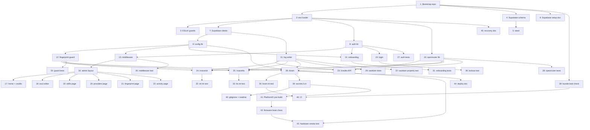

# Implementation Plan

## Overview

This plan breaks the design into ordered, independently verifiable tasks. Each task references the requirements and properties it satisfies. Tasks are sized to land in a single PR-style commit.

The dependency graph is at the bottom of the file. Follow numerical order unless the graph allows parallelism.

## Tasks

## Phase 0: Repository Bootstrap

- [x] 1. Initialize the Next.js 15 (App Router) project in `/Users/gilang/ngoding/BMO-DASHBOARD/` with TypeScript strict mode, Tailwind CSS v4, ESLint, and Vitest
  - Scaffold via `pnpm create next-app@latest` with App Router, TS, Tailwind, src-less layout, ESLint
  - Set `tsconfig.json` to `strict: true`, `noUncheckedIndexedAccess: true`, `noImplicitOverride: true`, `exactOptionalPropertyTypes: true`
  - Add Vitest + msw for mocking HTTP
  - Pin Node version in `package.json` engines field (>= 20.18)
  - Add `.gitignore` covering `.env`, `.env.local`, `.env.*.local`, `node_modules`, `.next`, `coverage`, `.vercel`, `.vscode/settings.json`
  - Commit `.env.example` listing every required env var name with placeholder values only (no real secrets)
  - _Validates: Requirements 12.3, 12.4_

- [x] 2. Configure `lib/env.ts` as a single zod-validated env loader
  - Schema fields: `NEXT_PUBLIC_SUPABASE_URL`, `NEXT_PUBLIC_SUPABASE_ANON_KEY`, `SUPABASE_SERVICE_ROLE_KEY`, `OPENROUTER_API_KEY`, `AUTH_SESSION_SECRET`
  - Distinguish public (`NEXT_PUBLIC_*`) from server-only via separate exports `publicEnv` and `serverEnv`
  - `serverEnv` getter throws if read at module-init in a non-server context
  - First line of file: `import 'server-only'` for the server export
  - Add a unit test that asserts importing `serverEnv` from a `'use client'` test file fails type-check
  - _Validates: Requirements 12.1, 12.2_

- [x] 3. Add ESLint rule `no-restricted-imports` blocking `lib/supabase-admin` and `lib/env (server)` from any path under `app/(admin)/**` and `app/onboarding/**` and `app/login/**` client components
  - Run `pnpm lint` in CI; fails the build on violations
  - _Validates: Requirements 12.2; Property 8_

## Phase 1: Supabase Schema

- [x] 4. Author `supabase/schema.sql` with the four tables (`admin`, `config`, `activity_log`, `auth_attempts`) and RLS policies that block anon access on all four
  - `admin` and `config` use `id = 1` check constraints to enforce singletons
  - `activity_log` indexed on `created_at desc`
  - `auth_attempts` indexed on `(username, attempted_at desc)`
  - All four: `enable row level security` + a single `for all to anon using (false)` policy
  - _Validates: Requirements 1, 11.2; Properties 1, 12, 13_

- [x] 5. Author `supabase/seed.sql` with a default BMO soul markdown (placeholder text, original prose) and the six default skill rows
  - Skills default state: web_search enabled, sing enabled, story enabled, comfort enabled, play_pretend enabled, play_music disabled
  - Soul placeholder is a `## Default soul — please edit` stub (no copyrighted content)
  - _Validates: Requirements 5.5, 6.1_

- [x] 6. Document Supabase project setup in `docs/SUPABASE-SETUP.md`: create project, run schema.sql, run seed.sql, copy the three URL/anon/service-role values into Vercel env, restrict the project URL to your domain
  - _Validates: Requirements 13.3_

## Phase 2: Server Library Layer

- [x] 7. Implement `lib/supabase-admin.ts` (service-role client, server-only) and `lib/supabase-anon.ts` (browser-safe client)
  - First line of admin file: `import 'server-only'`
  - Singleton client per Vercel function instance (lazy init)
  - Exports `getServiceClient()` and `getAnonClient()` only — no raw client export
  - _Validates: Requirements 12.1, 12.2; Properties 8, 11_

- [x] 8. Implement `lib/auth.ts` with argon2id password hashing + JWT session cookies
  - Use `@node-rs/argon2` (no native build dependency, works on Vercel)
  - Argon2id params: memory 64 MiB, time 3, parallelism 4
  - Session JWT: HS256, secret = `serverEnv.AUTH_SESSION_SECRET`, exp = 24h
  - Cookie attrs: `HttpOnly`, `Secure`, `SameSite=Lax`, `Path=/`
  - Exports: `hashPassword`, `verifyPassword`, `issueSessionCookie`, `readSession`, `isLockedOut`, `recordFailedAttempt`, `clearAttempts`
  - Use `node:crypto.timingSafeEqual` for any non-argon comparisons
  - _Validates: Requirements 2.2, 2.3, 2.7; Properties 6, 7_

- [x] 9. Implement `lib/config.ts` typed reader/writer for the `config` row with a 5-second per-instance cache
  - `getConfig(): Promise<BmoConfig>` — selects the singleton row, caches with `{ value, fetchedAt }`
  - `updateConfig(patch: Partial<BmoConfig>)` — merges + writes + clears cache
  - `clearConfigCache()` — exposed for tests and post-write invalidation
  - Validate `soul_md` length ≤ 64 KiB before write; throw `ConfigValidationError` otherwise
  - _Validates: Requirements 5.4; Properties 15, 22, 23_

- [x] 10. Implement `lib/openrouter.ts` provider client
  - Functions: `chat`, `transcribe`, `synthesizeStream`, `fetchCredits`
  - All use native `fetch` with `AbortController`; no SDK dep
  - `synthesizeStream` is an async generator that yields PCM16 chunks; parses `data:` SSE frames, base64-decodes `delta.audio.data`
  - `transcribe` builds the `{ model, input_audio: { data: base64, format } }` body shape that we proved works
  - All errors throw typed `OpenRouterError(stage, status, message)`
  - 30s STT timeout, 60s LLM timeout, 30s TTS timeout per call
  - Reads key from `serverEnv.OPENROUTER_API_KEY` only
  - _Validates: Requirements 7, 8, 9, 10.1, 10.4; Properties 16, 19_

- [x] 11. Implement `app/api/_lib/log.ts` activity-log writer with sanitization
  - `writeActivityLog(row)` validates the row shape, drops any field matching the sanitizer regex set (`fingerprint`, `password`, `api[_-]?key`, `authorization`, `bearer`, `sk-(ant|or|proj)`, `aoaAA`, `aorAA`)
  - Truncates `input_text` and `reply_text` to 8 KiB each
  - Single insert into `activity_log`
  - _Validates: Requirements 7.6, 8.6, 9.6, 11.2, 11.3, 11.4; Properties 9, 14, 20_

- [x] 12. Implement `app/api/_lib/fingerprint-guard.ts`
  - `verifyFingerprint(req)` reads `X-BMO-Fingerprint` header
  - Compares supplied value against `config.fingerprint_hash` via `argon2.verify`
  - Returns `{ ok: false, reason: 'missing' | 'mismatch' }` on rejection
  - Never logs the supplied or stored value
  - Reads through cached `getConfig()` so rotation propagates within 5s
  - _Validates: Requirements 3.1, 3.2, 3.3, 3.5, 4.5; Properties 5, 6, 7, 9, 22_

## Phase 3: Onboarding & Auth

- [x] 13. Implement `app/middleware.ts` per the design (skip API routes for fingerprint paths; admin-row count cache 30s; redirect/404 logic)
  - Static and `/_next/*` paths skip middleware entirely
  - `/api/voice/*`, `/api/brain`, `/api/openrouter/*` skip middleware (those handlers do their own auth)
  - `/onboarding` returns 404 if admin count ≥ 1; reachable if count = 0
  - Any other path: redirect to `/onboarding` if count = 0; redirect to `/login` if count ≥ 1 and no valid session cookie
  - _Validates: Requirements 1.1, 2.1, 13.1, 13.2; Properties 3, 4_

- [x] 14. Implement `app/onboarding/page.tsx` (server component) and `app/onboarding/actions.ts` (server action `createAdmin`)
  - Form fields: username, password, fingerprint (or "generate" toggle)
  - Server-side validation: password length ≥ 12, fingerprint ≥ 32 bytes hex/base64
  - On submit: re-check admin count, hash password (argon2id), hash fingerprint (argon2id), insert admin + upsert config in a single PostgREST RPC
  - Returns 409 if admin already exists
  - Renders the generated fingerprint exactly once with a copy-to-clipboard button before redirecting to `/login`
  - _Validates: Requirements 1.2, 1.3, 1.4, 1.5, 1.6, 1.7; Properties 1, 2, 3_

- [x] 15. Implement `app/login/page.tsx` (server component) and `app/login/actions.ts` (server action `login`)
  - Form: username + password
  - On submit: check `isLockedOut(username)` → 429 if true
  - Lookup admin by username; verify password against argon2id hash
  - On success: clear `auth_attempts`, issue session cookie, redirect to `/`
  - On failure: record failed attempt, return generic 401
  - _Validates: Requirements 2.2, 2.4, 2.7; Property 6_

## Phase 4: Admin UI

- [x] 16. Implement `app/(admin)/layout.tsx` with a sidebar nav (Home, Soul, Skills, Providers, Fingerprint, Activity) and a "logout" button
  - Layout reads session from middleware-set header; renders username
  - Logout button: server action that clears the session cookie
  - _Validates: Requirements 2.1; Property 4_

- [x] 17. Implement `app/(admin)/page.tsx` home page: live OpenRouter credits + recent 10 activity log entries
  - Server component for initial render
  - Client component `<CreditsLive />` polls `/api/openrouter/credits` every 60s with a 30s server-side cache
  - Displays "stale" badge if last fetch failed
  - _Validates: Requirements 10.5, 10.6, 11.1_

- [x] 18. Implement `app/(admin)/soul/page.tsx` markdown editor
  - Client component with a textarea + live char count + 64 KiB cap
  - "Save" submits a server action that calls `updateConfig({ soul_md })`
  - On 64 KiB exceed: inline validation error, no submit
  - Shows last-saved timestamp
  - _Validates: Requirements 5.1, 5.2, 5.4; Properties 15, 23_

- [x] 19. Implement `app/(admin)/skills/page.tsx` skill toggle list
  - Server component with form actions per skill
  - Each skill shows: name, description (one line), enabled toggle, optional params block (collapsed)
  - Saving updates `config.skills` JSONB
  - _Validates: Requirements 6.1, 6.2_

- [x] 20. Implement `app/(admin)/providers/page.tsx` model + voice selector
  - Dropdowns: LLM model, STT model, TTS model, TTS voice
  - LLM and STT default to a curated list (hardcoded constants); TTS voice list = `['nova','alloy','echo','shimmer','onyx','fable','sage','coral']`
  - "Test STT" / "Test TTS" buttons that call the API with a tiny fixture and show round-trip ms
  - _Validates: Requirements 10.7_

- [x] 21. Implement `app/(admin)/fingerprint/page.tsx` rotate + masked view
  - Default render: shows last 4 chars of stored hash NOT the value (the hash is one-way, so we display "••••" + the last 4 chars of the original at-creation reveal which is not stored — we instead show "set" / "not set" status)
  - Actually: since we store only the hash, we cannot reveal the original value. The page shows "Fingerprint configured ✓" + a "Rotate" button that:
    - Generates a new fingerprint server-side
    - Hashes it, writes the hash to `config.fingerprint_hash`
    - Returns the plaintext exactly once for the user to copy + flash to firmware
    - After 60 seconds, the plaintext is removed from the page
  - Banner warning: "Re-flash the BMO firmware with the new value before it can reconnect."
  - _Validates: Requirements 3.6, 4.1, 4.2, 4.3, 4.4, 4.5, 4.6; Property 22_

- [x] 22. Implement `app/(admin)/activity/page.tsx` log viewer
  - Server component renders a paginated table (50 rows per page, latest first)
  - Per row: timestamp, type, model_*, total_ms, status, error_stage if any
  - Click-through expands to show input_text and reply_text
  - "Delete" action removes a single row
  - _Validates: Requirements 11.1, 11.5; Property 13_

## Phase 5: Firmware-Facing API

- [x] 23. Implement `app/api/openrouter/credits/route.ts`
  - Accepts both session-authenticated browser GET (for the home page poller) and fingerprint-authenticated firmware GET
  - Calls OpenRouter `/credits`, returns `{ total, used, remaining, currency }`
  - 30s in-memory cache per Vercel function instance
  - On upstream failure: returns last successful body with `stale: true`
  - _Validates: Requirements 10.4, 10.5, 10.6; Property 5_

- [x] 24. Implement `app/api/voice/stt/route.ts`
  - Verifies fingerprint
  - Reads body up to 25 MB; rejects with 413 if exceeded
  - Detects content-type (wav / mpeg / webm), maps to OpenRouter `format`
  - Calls `transcribe()`; returns `{ text, duration_ms, model }`
  - On any error: returns 502 with `{ stage: 'stt', error }`
  - Writes one activity log row in `finally`
  - _Validates: Requirements 7.1, 7.2, 7.3, 7.4, 7.5, 7.6; Properties 16, 18, 19, 20_

- [x] 25. Implement `app/api/voice/tts/route.ts`
  - Verifies fingerprint
  - Reads JSON `{ text, voice?, format? }`; rejects 413 if text > 4000 chars
  - Calls `synthesizeStream()` and pipes raw PCM16 chunks to client with WAV header prepended
  - Sets `Content-Type: audio/L16;rate=24000;channels=1` (or `audio/wav` if header included), `X-BMO-Audio-Duration-Ms` header
  - On error before first byte: returns 502 with `{ stage: 'tts', error }`
  - On error mid-stream: errors the stream, writes log row in `finally`
  - _Validates: Requirements 8.1, 8.2, 8.3, 8.4, 8.5, 8.6; Properties 16, 17, 18, 19, 20_

- [x] 26. Implement `app/api/brain/route.ts` full-pipeline handler
  - Verifies fingerprint
  - Parses request: JSON `{ text }` OR multipart form-data with `audio` field
  - If audio: invokes STT internally (call same logic as `/api/voice/stt` without re-verifying fingerprint)
  - Loads soul + enabled skills from config
  - Calls `chat()` with soul as system prompt, skills as available tools
  - Streams TTS response back as PCM16 chunks
  - `X-BMO-Reply-Text` header carries first 1 KiB of the reply text URL-encoded
  - Per-stage error attribution via 502 + `{ stage }`
  - Single activity log row written in `finally` regardless of stage of failure
  - 20-second total budget for inputs of 30s audio or 1000 chars text
  - _Validates: Requirements 9.1, 9.2, 9.3, 9.4, 9.5, 9.6; Properties 16, 17, 18, 19, 20, 21, 23_

## Phase 6: Tests

- [x] 27. Unit tests for `lib/auth.ts`
  - hashPassword/verifyPassword round-trip with several inputs
  - verifyPassword returns false on tampered hash
  - isLockedOut returns true after 5 inserts within 15 min, false outside the window
  - clearAttempts wipes only the named user's rows
  - _Validates: Requirements 2.2, 2.7; Property 6_

- [x] 28. Unit tests for `lib/openrouter.ts`
  - chat request body matches the documented OpenRouter shape
  - transcribe wraps PCM16 in WAV header bytes per RIFF spec
  - synthesizeStream parses an SSE stream fixture into base64 audio chunks
  - synthesizeStream propagates AbortController abort
  - All three throw OpenRouterError with the right stage on non-2xx
  - _Validates: Requirements 7, 8, 9, 10; Properties 16, 19_

- [x] 29. Unit tests for `app/api/_lib/log.ts` sanitizer
  - Each banned field (fingerprint, password, api_key, authorization, bearer, sk-…) gets stripped
  - Truncation cap holds at 8 KiB per text field
  - _Validates: Requirements 11.4; Properties 9, 14_

- [x] 30. Unit tests for `app/api/_lib/fingerprint-guard.ts`
  - Missing header → reason `missing`
  - Mismatched value → reason `mismatch`
  - Matching value → ok
  - Rotation: after `updateConfig({ fingerprint_hash })`, old value is rejected within 5s (via cache-clear test)
  - _Validates: Requirements 3.1, 3.2, 3.3, 4.5; Properties 5, 7, 22_

- [x] 31. Unit tests for onboarding action `createAdmin`
  - Fresh DB: insert succeeds, returns the plaintext fingerprint exactly once
  - Second call returns 409 even from the same client
  - Password length < 12 returns `weak_password`
  - Fingerprint < 32 bytes returns `invalid_fingerprint`
  - _Validates: Requirements 1.2, 1.3, 1.4, 1.6; Properties 1, 2_

- [x] 32. Integration test: `/api/voice/stt` happy path with msw mocking OpenRouter
  - Send a 1-second WAV fixture with valid fingerprint
  - Assert 200, body shape, one log row inserted, no raw audio in log
  - _Validates: Requirements 7; Property 20_

- [x] 33. Integration test: `/api/voice/tts` happy path
  - Send `{ text: "hi" }` with valid fingerprint, mocked OpenRouter SSE stream
  - Assert Content-Type, X-BMO-Audio-Duration-Ms header, body bytes match the fixture, log row written
  - _Validates: Requirements 8; Properties 17, 20_

- [x] 34. Integration test: `/api/brain` text input path
  - Send `{ text: "ping" }` with valid fingerprint, mocked LLM chat + audio stream
  - Assert PCM16 streamed back, log row carries input_text="ping" + reply_text + total_ms
  - _Validates: Requirements 9; Properties 16, 17, 20, 23_

- [x] 35. Integration test: middleware onboarding gate
  - Empty admin table: GET / redirects to /onboarding
  - One admin row: GET /onboarding returns 404
  - Empty admin table + GET /onboarding: 200
  - _Validates: Requirements 1.1, 13.1; Properties 3, 4_

- [x] 36. Integration test: login lockout
  - Insert 5 failed attempts within 14 minutes
  - 6th attempt returns 429
  - After 16 minutes (mocked time): next attempt allowed
  - _Validates: Requirements 2.7; Property 6_

- [x] 37. Property test: log sanitizer never leaks a secret-shaped value
  - fast-check generator emits objects with arbitrary nested fields containing strings matching each banned regex
  - Property: after `writeActivityLog(generated)`, the corresponding DB row contains zero substrings matching any banned regex
  - _Validates: Requirements 11.4; Properties 9, 14_

- [x] 38. Build-time secret-leak check script in `scripts/check-bundle-secrets.mjs`
  - Runs after `pnpm build`
  - Greps `.next/static/**/*.js` for the literal env var names that should never reach the client (`SUPABASE_SERVICE_ROLE_KEY`, `OPENROUTER_API_KEY`, `AUTH_SESSION_SECRET`)
  - Greps for the secret-shape regexes (`sk-ant-`, `sk-or-`, `aoaAA`)
  - Exits 1 on any match; CI step calls this after build
  - _Validates: Requirements 12.2, 12.7; Property 11_

## Phase 7: Firmware Wiring

- [x] 39. In the BMO firmware repo, add `firmware/bmo_face_anim/include/secrets.h.in` (committed) listing `BMO_DASHBOARD_URL` and `BMO_FINGERPRINT` macros with `@PLACEHOLDER@` values
  - _Validates: Requirements 12.5_

- [x] 40. In the BMO firmware repo, add `firmware/bmo_face_anim/include/secrets.h` to `.gitignore` and document copy-template flow in `firmware/bmo_face_anim/README.md`
  - _Validates: Requirements 12.5, 12.6_

- [x] 41. Add a PlatformIO `extra_scripts` Python pre-build hook that fails the build if `secrets.h` is missing, with a clear error pointing the developer to the template
  - _Validates: Requirements 12.6_

- [x] 42. Add a firmware module `bmo_brain_client.cpp/h` that issues HTTPS POST to `<BMO_DASHBOARD_URL>/api/brain`, sends the `X-BMO-Fingerprint` header, streams audio response chunks into the I2S audio output ring buffer
  - Uses `WiFiClientSecure` + `HTTPClient` (or `esp_http_client`)
  - Connection timeout 5s; total response budget 30s
  - On non-200: animates the `error` mood for 1s then `idle`
  - On streamed response: pipes 4 KiB audio chunks straight into the I2S buffer, animates `talking` mood
  - _Validates: Requirements 3.1, 9.3, 9.4_

- [x] 43. End-to-end manual hardware test documented in `docs/HARDWARE-SMOKE-TEST.md`
  - Steps: deploy dashboard, complete onboarding, copy fingerprint into `secrets.h`, flash firmware, hold touch button + speak, verify audible reply
  - Negative test: rotate fingerprint in dashboard → firmware fails until re-flashed
  - _Validates: Requirements 3.1, 3.6, 9_

## Phase 8: Deployment & Docs

- [x] 44. Write `docs/DEPLOY.md` covering Vercel project setup, env var configuration, Supabase project creation, schema/seed application, custom domain
  - _Validates: Requirements 12.1, 13.2_

- [x] 45. Write `docs/RECOVERY.md` covering Supabase-direct admin row reset and fingerprint-loss recovery
  - _Validates: Requirements 2.5, 13.3; Property 2_

- [x] 46. Add CI (GitHub Actions): lint → typecheck → unit tests → integration tests → build → secret-leak check
  - PRs that fail any step block merge
  - _Validates: Requirements 12.7; Properties 10, 11_

## Task Dependency Graph

```json
{
  "waves": [
    { "id": "wave-1-bootstrap",       "tasks": [1] },
    { "id": "wave-2-config",          "tasks": [2] },
    { "id": "wave-3-guards",          "tasks": [3, 4, 5, 6] },
    { "id": "wave-4-server-libs",     "tasks": [7, 8, 10] },
    { "id": "wave-5-config-and-log",  "tasks": [9, 11] },
    { "id": "wave-6-fingerprint",     "tasks": [12] },
    { "id": "wave-7-middleware-auth", "tasks": [13, 15] },
    { "id": "wave-8-onboarding",      "tasks": [14] },
    { "id": "wave-9-admin-shell",     "tasks": [16] },
    { "id": "wave-10-admin-pages",    "tasks": [17, 18, 19, 20, 21, 22] },
    { "id": "wave-11-firmware-api",   "tasks": [23, 24, 25] },
    { "id": "wave-12-brain",          "tasks": [26] },
    { "id": "wave-13-unit-tests",     "tasks": [27, 28, 29, 30, 31] },
    { "id": "wave-14-integration",    "tasks": [32, 33, 34, 35, 36, 37] },
    { "id": "wave-15-bundle-check",   "tasks": [38] },
    { "id": "wave-16-firmware",       "tasks": [39, 40, 41, 42, 43] },
    { "id": "wave-17-deploy-docs",    "tasks": [44, 45, 46] }
  ]
}
```



The graph permits parallel work within phases. Roughly:

- **Phase 0** (1–3) is sequential and small, do it first.
- **Phase 1** (4–6) and **Phase 2** (7–12) can run in parallel after Phase 0.
- **Phase 3** (13–15) waits on `auth` (8) + `config` (9).
- **Phase 4** (16–22) waits on `middleware` (13).
- **Phase 5** (23–26) waits on `openrouter` (10), `log` (11), `fingerprint guard` (12).
- **Phase 6** tests can run in parallel as their targets land.
- **Phase 7** firmware wiring waits on `/api/brain` (26).
- **Phase 8** documentation can be done in parallel any time after the relevant code lands.

A reasonable single-developer order: 1, 2, 3, 4, 7, 8, 9, 10, 11, 12, 13, 14, 15, 16, 17, 23, 18, 19, 20, 21, 22, 24, 25, 26, 27, 28, 29, 30, 31, 32, 33, 34, 35, 36, 37, 38, 5, 6, 39, 40, 41, 42, 43, 44, 45, 46.

## Notes

- **Single-developer order** (linearized respecting dependencies): 1, 2, 3, 4, 7, 8, 9, 10, 11, 12, 13, 14, 15, 16, 17, 23, 18, 19, 20, 21, 22, 24, 25, 26, 27, 28, 29, 30, 31, 32, 33, 34, 35, 36, 37, 38, 5, 6, 39, 40, 41, 42, 43, 44, 45, 46.
- **Parallel waves** are defined in the JSON above. Within a wave, tasks have no inter-dependencies and may be executed concurrently.
- **Test discipline**: each implementation task lands with at least its corresponding unit test(s) green; integration tests in Phase 6 land after their target route exists.
- **Secret discipline**: no real env values land in this repo at any point. `.env.example` is the only env file ever committed. Real values live in Vercel's project env and a local `.env.local` that's gitignored.
- **Cost guardrails**: every OpenRouter call carries an `AbortController`. The bridge tracks per-stage time; a future task can extend this into per-day cost caps if needed.
- **Spec ownership**: this `tasks.md` lists *what* to build. Architectural decisions live in `design.md`. Behavioral acceptance lives in `requirements.md`. If a task description deviates from the design or the requirements, the spec docs win — update the spec, then update the task, before writing code.
