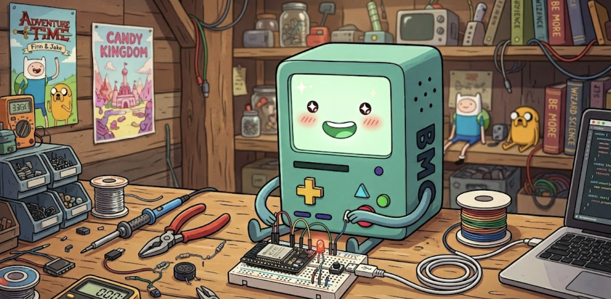

<div align="center">

# BMO

### A tiny living friend, built from a pocket of parts.



[](LICENSE)
[](https://www.espressif.com/en/products/socs/esp32-c3)
[](#-ai-features--live-now)
[](#)

> ## ⭐ **Star it. Fork it. Build it.** ⭐

*"Hi friend!"*

</div>

---

## 🤖 AI features — live now

BMO listens, thinks, and talks back.

Hold the touch sensor, speak, and let go. BMO captures your voice, ships it to the cloud brain, and answers out loud in its own little voice — with a face that shows every step.

- **🎙️ Push-to-talk via the touch sensor.** Press and hold BMO, say anything, release. Walkie-talkie style.
- **🧠 Real conversations** — speech-to-text → LLM → streaming text-to-speech, all through the dashboard's `/api/brain` route on OpenRouter.
- **🗣️ Real lip-sync.** The talking mouth tracks the live audio envelope, so BMO's mouth actually moves with its voice — eyes stay open and lively.
- **🧩 Conversation memory.** BMO remembers the last several turns, so follow-ups make sense ("what color is an apple?" → "red" → BMO knows what you mean). A gbrain-inspired profile learns durable facts (name, favorites) and the newest value wins.
- **🎭 Mood-aware status face.** Listening shows X-eyes + a signal glitch, thinking pulses a processing orb with a datamosh flicker, talking lip-syncs — so the screen is never frozen during network work.
- **🌐 Wi-Fi setup over a captive portal.** No serial-cable provisioning, no hardcoded credentials in flash — a rotatable device fingerprint is the only secret on the chip.
- **🎨 Baked toy-voice greetings.** Short BMO-voice greetings are generated once from the dashboard TTS, downsampled, and baked as compact 4-bit ADPCM clips that play instantly (and lip-sync) on a normal touch.

Full architecture and the debugging war stories are in [`documentation.html`](documentation.html) under "Voice, brain & memory."

---

## 🧠 BMO's brain — what we adopted from GBrain

BMO's memory layer is modeled on [Garry Tan's GBrain](https://github.com/garrytan/gbrain), the agent brain behind his OpenClaw/Hermes deployments. GBrain ships its capabilities as markdown "skills" for an autonomous coding agent plus a daemon on a VPS — which can't run inside Vercel's stateless functions. So BMO **reproduces GBrain's load-bearing ideas as real TypeScript** on the stack it already has (Supabase pgvector + OpenRouter embeddings). These are working modules backed by real tables and RPCs, not inert skill files.

| GBrain idea | BMO calls it | Implemented in |
| --- | --- | --- |
| `capture` + brain-first recall | **Persistent memory** — every exchange embedded, recalled by meaning before replying | `dashboard/lib/brain.ts` |
| `think` (synthesis + gap analysis) | **Reasoned recall** — a cited answer plus an honest "what I don't know yet" | `dashboard/lib/brain/synthesize.ts` |
| self-wiring knowledge graph + `enrich` | **Connected memories** — people/places/topics as entities with typed links | `dashboard/lib/brain/graph.ts`, `entities.ts` |
| enrich-the-entity-over-time | **Child profile** — durable facts (name, favorites, fears), newest value wins | `dashboard/lib/brain/profile.ts` |
| salience + dedup | **Importance & tidy-up** — score what matters, find near-duplicates | `dashboard/lib/brain/salience.ts` |
| 24/7 **dream cycle** (`maintain`) | **Dream cycle** — scheduled consolidate/dedup/re-score pass | `dashboard/lib/brain/consolidate.ts` + `/api/brain/dream` |
| `find_trajectory` / timeline | **Timeline** — what happened, in what order | `dashboard/lib/brain/timeline.ts` |
| hybrid search | **Hybrid search** — vector + keyword fused via reciprocal-rank fusion | `dashboard/lib/brain/search.ts` |
| `gbrain doctor` / `skillpack-check` | **Brain health** — table/embeddings/recall checks → one score | `dashboard/lib/brain/doctor.ts` |
| dream-cycle idea, made spontaneous | **Random thoughts** — when played with, BMO recalls, muses one line in its own voice, speaks it, and remembers it | `dashboard/lib/thoughts.ts` + `/api/brain/idle-thought` |

The brain is always an **enhancement, never a hard dependency**: every function degrades to a safe no-op and logs a warning if a table or upstream call is missing, so `/api/brain` never fails because a brain feature did. A migration seam (`GBRAIN_HTTP_URL` + `GBRAIN_TOKEN`) is already stubbed in `lib/brain.ts` so capture/recall can later point at a real `gbrain serve --http` daemon on a VPS without changing the routes or firmware.

---

## 🛰️ The dashboard — BMO's brain on the web

A full Next.js 15 admin lives under [`dashboard/`](dashboard/). It's the cloud half of BMO: the device talks to it over HTTPS, you tune BMO's personality through it, and you keep an eye on what BMO is up to from anywhere.

- **🔐 Single-admin auth that just works.** One operator, one password (argon2id), one device fingerprint header. No OAuth dance, no multi-tenant clutter — exactly what a personal robot needs.
- **🔄 Rotatable device fingerprint.** A separate secret that lives only in firmware flash. Lose the device, rotate the fingerprint in the dashboard, the old BMO can't talk to your account anymore.
- **💸 Live OpenRouter credit meter.** See remaining balance update in real time so BMO never goes silent mid-conversation because the wallet ran dry.
- **📜 Activity log.** Every request the device makes — STT, LLM, TTS — with latency, status, and which stage failed if anything went wrong. Debugging from the couch.
- **🎭 Edit BMO's soul.** The system prompt, voice, model picks for brain/STT/TTS, and personality dials are all editable in the **Soul** tab. Changes ship to the device on its next request.
- **🎤 Curate songs and skills.** Drop in WAVs the device can sing back, or wire new tool-call skills BMO can trigger.
- **🛡️ Server-only secrets, enforced.** A `check-bundle-secrets` build step scans the client bundle for any leaked server key and fails the deploy if it finds one. Even the CI placeholder is a deliberate canary.
- **🚀 Vercel-ready.** Push to `master`, the dashboard ships. Full walk-through in [`dashboard/docs/DEPLOY.md`](dashboard/docs/DEPLOY.md).

```
ESP32-C3 ──HTTPS + X-BMO-Fingerprint──▶ Vercel (Next.js 15)
                                             │
                                             ├─▶ Supabase (admin, soul, songs, activity)
                                             └─▶ OpenRouter (Whisper / Claude / TTS)
```

Local dev:

```bash
cd dashboard
cp .env.example .env.local   # fill in Supabase + OpenRouter + AUTH_SESSION_SECRET
npm install
npm run dev
```

Then visit http://localhost:3000 and follow the onboarding wizard.

---

## Why does this exist?

Most people walk past a screen on a desk and feel nothing. We thought you deserved better.

So we built BMO. Not a copy. Not a tribute. A small friend who happens to live on a 1.8-inch screen and a five-dollar microcontroller — and who blinks, laughs, gets shy when you touch it, and yells "Hooray!" when you hold it long enough.

This is what happens when you stop making things to *do* things, and start making things that simply make you smile.

---

## ✨ What it is

A complete, hackable BMO — face animation, voice, touch reactions, pre-baked sound clips — built from a small handful of parts that fit in your palm.

- **25 moods.** Idle, blink, happy, laugh, wink, love, talk, listen, focused, surprise, excited, scared, hungry, hot, cold, sick, dizzy, glitch, confused, bored, sad, angry, cool, wake, sleepy. Each one is a real animation, not a static pose.
- **Touch reactions you can feel.** Quick poke makes BMO gasp and dart its eyes. Hold it and it blushes and purrs. Hold it longer and its eyes turn into hearts. Tickle it (three rapid taps) and it loses its mind laughing.
- **A real voice.** Drop in WAV clips of BMO saying anything you want, run one Python script, and BMO speaks them back to you on touch.
- **30 fps, double-buffered, no flicker.** A 40 KB framebuffer in RAM is composed every frame and pushed in one hardware-SPI burst. Smooth as butter.
- **Built by hand. Open by design.** No closed firmware. No mystery sauce. Just C++ and Python you can read in an afternoon.

---

## 🎨 The cast

```
ESP32-C3 Super Mini       the brain
ST7735 1.8" TFT           the face
MAX98357A I2S amp         the voice box
8Ω 1W speaker             the actual voice
INMP441 I2S mic           the ears (ready for AI conversation)
TTP223 touch sensor       the soul
breadboard + jumper wires the stage
```

That's it. No PCB. No surface mount. No dark magic. Anyone with a soldering iron and patience can build BMO this weekend.

---

## 📦 Prerequisites

A few things to install before the magic starts. Pick the camp you live in:

### Required (everyone)

- **PlatformIO** — the unified build system that flashes the firmware. Two ways:
  - **VS Code extension** (recommended): install [VS Code](https://code.visualstudio.com/), then add the [PlatformIO IDE](https://marketplace.visualstudio.com/items?itemName=platformio.platformio-ide) extension. Done.
  - **Or CLI only**: `pip install platformio` if you prefer the terminal.

- **A USB-C data cable**. Charge-only cables are a real thing and they'll cost you an hour. Use the one that came with your phone for sync.

- **Drivers** for the ESP32-C3's native USB-CDC. macOS and recent Linux work out of the box. On Windows you may need the [USB-CDC driver](https://www.silabs.com/developers/usb-to-uart-bridge-vcp-drivers) if the port doesn't appear.

### Optional (for the web simulator)

The Next.js + Tailwind simulator is on the roadmap (see [AI features coming soon](#-ai-features--coming-soon)). It will use the [Web Serial API](https://developer.mozilla.org/en-US/docs/Web/API/Web_Serial_API), so once it lands you'll need:

- **Node.js 22+** — [nodejs.org](https://nodejs.org/) or use [nvm](https://github.com/nvm-sh/nvm)
- **Chrome or Edge** desktop browser. Safari and Firefox don't support Web Serial yet.

### Optional (for baking tiny toy voice clips)

- **Python 3.10+**
- **ffmpeg** — used by the generator and by MP3/WAV conversion:
  ```bash
  brew install ffmpeg          # macOS
  sudo apt install ffmpeg      # Ubuntu/Debian
  ```

### Optional (for designing BMO's 3D-printed shell)

- **Python 3.11+** with `build123d`:
  ```bash
  pip install build123d
  ```
- A 3D printer or a friend who has one. FDM with PLA is plenty for BMO.

---

## 🚀 Get started in five minutes

```bash
git clone git@github.com:AlleyBo55/BMO-ESP32.git bmo
cd bmo

# Firmware
cd firmware/bmo_face_anim
pio run -t upload
```

Plug in your USB cable. BMO comes alive. Touch it. Hear it greet you back.

---

## ⚡ Don't want to build? Flash a prebuilt binary

Every release ships ready-to-flash binaries built by GitHub Actions — no PlatformIO, no toolchain, no repo checkout. You just need Python's `esptool`.

1. **Grab the binaries.** Download the latest from [**Releases**](https://github.com/AlleyBo55/BMO-ESP32/releases) (or the **Artifacts** of a [firmware build run](https://github.com/AlleyBo55/BMO-ESP32/actions)). Unzip.
2. **Plug BMO in** with a **data** USB-C cable.
3. **Flash with one command:**

   ```bash
   pip install esptool      # one-time
   ./flash.sh               # auto-detects the port, flashes the merged image
   ```

   Handy flags: `./flash.sh -p /dev/ttyACM0` (pick the port), `--erase` (wipe saved WiFi), `--monitor` (watch the serial log after). Prefer raw esptool? `esptool.py --chip esp32c3 write_flash -z 0x0 bmo-firmware-merged.bin`.

4. **Set up WiFi on the device.** First boot, BMO opens a **`BMO-Setup-XXXX`** WiFi hotspot. Join it from your phone and enter your home WiFi + dashboard URL — no creds are baked into the public binary.

> **Heads up:** public binaries are **generic** — they carry no WiFi password and no dashboard auth fingerprint. BMO will animate, take WiFi setup, and run locally, but **talking to the cloud brain needs a personalized build** with your dashboard fingerprint compiled in (set the `BMO_FINGERPRINT` repo secret for a private CI build, or flash locally with your `.env`). Full details in [`firmware/bmo_face_anim/README-WIRING.md`](firmware/bmo_face_anim/README-WIRING.md#flashing-a-prebuilt-binary-no-platformio).

---

## 📖 Wiring & how it all works

**Everything you need is in [`documentation.html`](documentation.html).**

Open it in any browser. The full pin map, the troubleshooting guide, the animation pipeline, the touch reaction breakdown, the voice clip baking workflow — it's all there with diagrams, code samples, and the painful debugging history we went through so you don't have to.

Highlights:
- 14 GPIOs mapped across 4 components, with rationale for every choice
- The exact wire-by-wire recovery sequence if your screen turns white
- Why both Adafruit_ST7735 and TFT_eSPI silently broke on the C3, and how we fixed it
- The 4-phase animation breakdown for every touch gesture
- Power budget math and why you need a 1A wall adapter, not a laptop USB port

---

## 🏗️ What's in the project

```
BMO/
├── documentation.html          ← read this first
├── firmware/bmo_face_anim/     ← the embedded C++ that makes BMO live
│   ├── src/main.cpp
│   ├── audio/                  ← generated/drop-in WAV files live here
│   └── tools/                  ← voice generator + ADPCM baker
├── dashboard/                  ← Next.js 15 admin + cloud brain (Vercel-ready)
│   ├── app/                    ← App Router pages: home, soul, songs, providers, activity, fingerprint
│   ├── lib/                    ← auth, env validation, OpenRouter + Supabase clients
│   ├── supabase/               ← schema + migrations + seed
│   └── docs/DEPLOY.md          ← end-to-end Vercel + Supabase walk-through
└── .kiro/steering/             ← CAD skills for designing BMO's 3D-printed shell
```

---

## 🎨 Design BMO's shell with Kiro steering

A face floating in the air on a breadboard is a prototype. A face inside a real chassis is a **friend**.

This repo ships with a full set of **Kiro steering files** under `.kiro/steering/` that turn any Kiro-powered editor into a CAD designer for BMO. Open the workspace in [Kiro](https://kiro.dev) and ask for things like:

> *"Design a 3D-printable face plate for the 1.8 inch ST7735 with M2 mounting holes and a recessed bezel."*
>
> *"Make a back shell that fits the C3 Super Mini and a 1000 mAh LiPo with a USB-C cutout."*
>
> *"Generate the BMO body assembly, ready for FDM printing in PLA."*

The steering set is the **CAD Skills suite** from [`earthtojake/text-to-cad`](https://github.com/earthtojake/text-to-cad), broken out as one steering doc per skill so each loads only when relevant:

- `cad-skill.md` — parametric build123d/Python parts, STEP-first workflow
- `step-parts-skill.md` — sourcing real screws, bearings, standoffs from [step.parts](https://step.parts)
- `render-skill.md` — CAD Explorer live preview + snapshot CLI
- `urdf-skill.md` / `srdf-skill.md` / `sdf-skill.md` — when BMO grows arms or wheels
- `sendcutsend-skill.md` — laser-cut metal preflight for SendCutSend orders
- `cad-harness.md` — repo-level discipline (source of truth, LFS, derived artifacts)
- `cad-skills-overview.md` — the dispatcher that routes tasks to the right skill

Workflow once installed:

```bash
# Optionally install the bundle for the live CAD Explorer viewer
npx skills add earthtojake/text-to-cad

# Set up the build123d Python env
python3.11 -m venv .venv
./.venv/bin/pip install build123d ocp-vscode

# Ask Kiro to design a part. It will write hardware/parts/<name>.py for you.
# Then export STEP/STL/3MF in one go:
./.venv/bin/python hardware/parts/bmo_face_plate.py
```

3D-print the result, screw the screen in, and BMO has a body.

---

## 🛠️ Build your own. Make it yours.

BMO is a starting point, not a finish line. Things people have already started:

- **Add a camera** (ESP32-S3-CAM upgrade) — BMO sees you
- **Wire in WiFi + Whisper + Claude + TTS** — BMO actually talks back
- **3D print a real chassis** — the `.kiro/steering/cad-skills-overview.md` has the parametric build123d workflow ready to go
- **Make BB8 instead** — same firmware shape, different face palette
- **Mount it on wheels** — patrol robot, daughter-watching robot, weather-station robot

Pull requests welcome. Issues welcome. Forks especially welcome. The most BMO thing you can do is take this and make it weirder.

---

## 💡 The honest truth

This started as one developer wiring an ST7735 to an ESP32 at 1 AM and getting a white screen for two hours. That's how every BMO begins. If you get stuck, the troubleshooting section was written from real scars.

The point was never to ship a product. The point was to remind ourselves that the small, useless, joyful things — the ones that don't optimize for anything except making you smile — are still the most fun to build.

Build BMO. Show your friend. Watch them try to tickle it. That's the whole prize.

---

<div align="center">

## License

[MIT](LICENSE) — do whatever you want, just keep the copyright line.

The BMO character is © Cartoon Network. This project is a fan tribute and personal-use educational kit. If you want to ship a commercial product based on this, replace the BMO likeness with your own design — the firmware shape ports cleanly to any character.

---

### One more thing

> *"Who wants to play video games?"* — BMO

⭐ **[Star this project](#)** if it made you smile.
🔱 **[Fork it](#)** if you're going to build one.
🛠️ **[Build it](documentation.html)** if you're ready to make a friend.

</div>
